# 🔐 PassGen — Secure Password Generator & Vault

<p align="center">

### A full-stack password generator and secure credential management platform

Generate strong passwords, securely store credentials, organize them into groups, recover accidentally deleted entries, and monitor your password vault through a centralized dashboard.

<br>


</p>

<p align="center">


<a href="https://ranpass.vercel.app/"></a>
</p>

---

# 📌 Table of Contents

- [Overview](#overview)
- [Problem Statement](#problem-statement)
- [Solution](#solution)
- [Key Features](#key-features)
- [System Architecture](#system-architecture)
- [Security Architecture](#security-architecture)
- [Authentication Flow](#authentication-flow)
- [Password Vault Flow](#password-vault-flow)
- [Database Design](#database-design)
- [Technology Stack](#technology-stack)
- [Project Structure](#project-structure)
- [REST API](#rest-api)
- [Performance & Scalability](#performance--scalability)
- [Installation](#installation)
- [Environment Variables](#environment-variables)
- [Screenshots](#screenshots)
- [Engineering Challenges](#engineering-challenges)
- [Future Improvements](#future-improvements)
- [Contributing](#contributing)
- [License](#license)
- [Author](#author)

---

# Overview

**PassGen** is a full-stack password generation and credential-management application.

It allows users to:

- Generate strong random passwords
- Customize password length and character types
- Store credentials inside an authenticated vault
- Organize credentials into groups
- Edit and manage stored entries
- Recover accidentally deleted passwords
- Permanently remove credentials
- Monitor vault statistics through a dashboard

The project focuses on combining **modern web development with practical security concepts**, including password hashing, encryption at rest, JWT authentication, protected APIs, and soft deletion.

---

# Problem Statement

Managing passwords becomes increasingly difficult as the number of online accounts grows.

Users commonly rely on:

- Reusing passwords
- Simple memorable passwords
- Browser notes
- Text files
- Unorganized documents
- Scattered credential storage

These approaches introduce multiple risks.

| Problem | Impact |
|---|---|
| Weak passwords | Easier for attackers to compromise accounts |
| Password reuse | One compromised credential can affect multiple accounts |
| Scattered credentials | Difficult to manage and retrieve passwords |
| Accidental deletion | Important credentials may be permanently lost |
| No organization | Difficult to manage large numbers of credentials |
| No security visibility | Users cannot easily understand their password distribution |

---

# Solution

PassGen addresses these problems by combining two major capabilities:

```text
                 PassGen
                    │
          ┌─────────┴─────────┐
          │                   │
   Password Generator    Secure Vault
          │                   │
   Strong Credentials    Encrypted Storage
          │                   │
          └─────────┬─────────┘
                    │
              User Dashboard
```

The platform provides a centralized location for generating, storing, organizing, recovering, and managing credentials.

---

#  Key Features

## 🔑 Password Generator

Generate secure random passwords with customizable options.

Features include:

- Custom password length
- Numbers toggle
- Symbols toggle
- One-click regeneration
- Instant password generation

Current supported password length:

```text
6 → 20 characters
```

---

## 📋 Copy to Clipboard

Generated passwords can be copied directly to the clipboard for convenient use.

---

## 💾 Secure Password Vault

Users can:

- Add credentials
- Edit credentials
- View stored entries
- Delete credentials
- Organize credentials into groups

Vault entries are encrypted before being stored in the database.

---

## 🗂️ Password Groups

Credentials can be organized into custom groups.

Example:

```text
My Vault
│
├── Work
│   ├── GitHub
│   ├── Jira
│   └── Slack
│
├── Personal
│   ├── Gmail
│   ├── Amazon
│   └── Netflix
│
└── Finance
    ├── Banking
    └── Payments
```

This provides a structured way to manage large vaults.

---

# 🗑️ Recycle Bin

Instead of immediately deleting credentials, PassGen uses **soft deletion**.

```text
Delete Entry
     │
     ▼
isDeleted = true
     │
     ▼
Recycle Bin
     │
     ├── Restore
     │
     └── Permanently Delete
```

This protects users against accidental deletion.

The vault entry remains recoverable until the user explicitly chooses permanent deletion.

---

# 📊 Dashboard

The dashboard provides an overview of the user's vault.

It can display:

- Total password count
- Group-wise password distribution
- Recently added credentials
- Overall vault activity

This gives users a quick overview without manually browsing every credential.

---

# 👤 Authentication

PassGen implements authenticated user accounts.

Users can:

- Register
- Login
- Access protected resources
- Manage their account
- Delete their account

Authentication is implemented using **JWT-based stateless authentication**. fileciteturn0file0L118-L125

---

# System Architecture

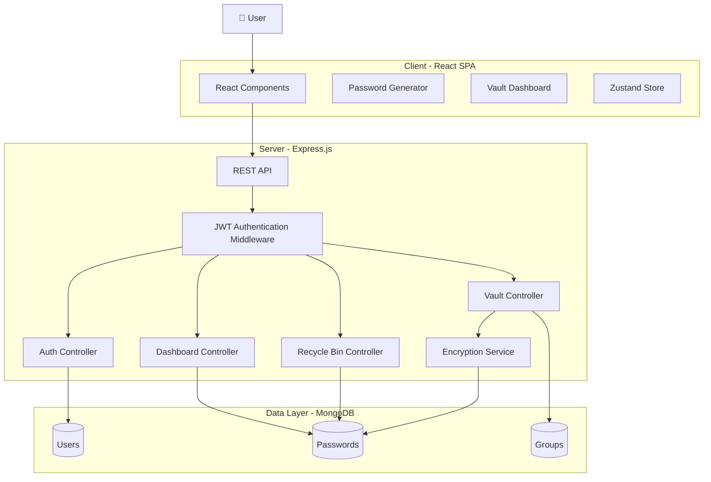

### Architecture Layers

| Layer | Responsibility |
|---|---|
| React | User interface |
| Zustand | Client-side state management |
| Express | REST API |
| JWT Middleware | Authentication |
| Controllers | Business logic |
| Encryption Service | Vault data encryption/decryption |
| MongoDB | Persistent storage |

---

# Security Architecture

Security is one of the core design considerations of PassGen.

The application uses different security mechanisms for different types of data.

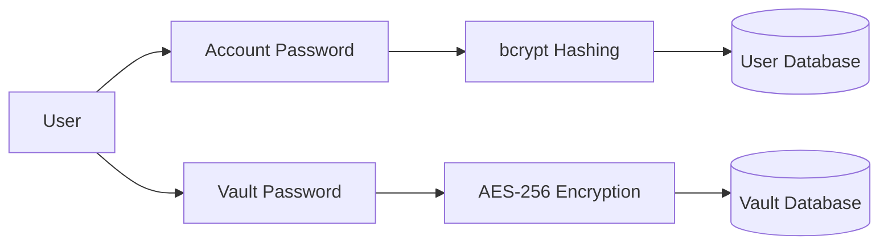

---

# 🔐 Hashing vs Encryption

PassGen deliberately uses **different mechanisms for different types of secrets**.

### User Account Password

Account passwords are hashed using **bcrypt**.

```text
Plain Password
      ↓
   bcrypt
      ↓
Password Hash
      ↓
   MongoDB
```

The original password is not stored.

### Vault Credentials

Vault passwords need to be retrieved by the application, so they are **encrypted rather than hashed**.

```text
Vault Password
      ↓
   AES-256
      ↓
Encrypted Value
      ↓
   MongoDB
```

This distinction is important because hashing is one-way, whereas encryption supports controlled decryption.

---

# 🔐 Encryption at Rest

Vault credentials are encrypted before being persisted in MongoDB.

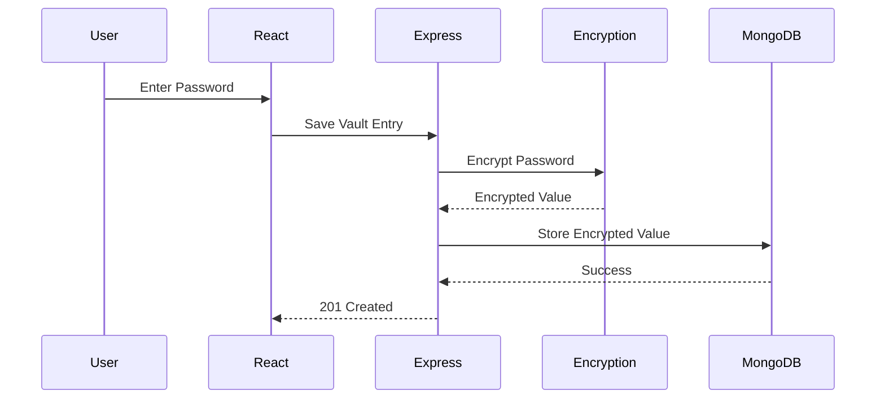

Therefore, the database stores:

```text
Encrypted Password
```

rather than:

```text
Plaintext Password
```

The encryption key should remain server-side and must never be exposed to the client. fileciteturn0file0L120-L127

---

# Authentication Flow

PassGen uses JWT-based authentication.

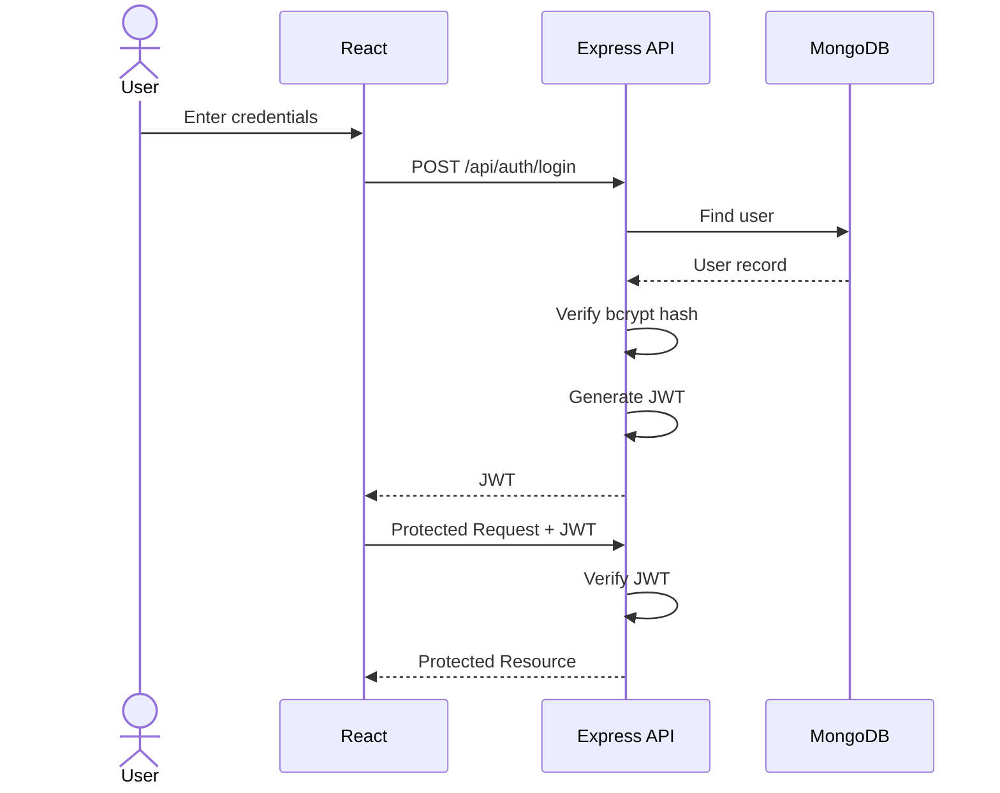

---

# 🛡️ Protected API Flow

```text
Client
   │
   │ HTTP Request + JWT
   ▼
Express API
   │
   ▼
JWT Middleware
   │
   ├── Invalid → 401 Unauthorized
   │
   └── Valid
         │
         ▼
      Controller
         │
         ▼
      MongoDB
```

This prevents unauthenticated users from accessing private vault resources.

---

# Database Design

The database consists of three major collections:

- Users
- Groups
- Password Entries

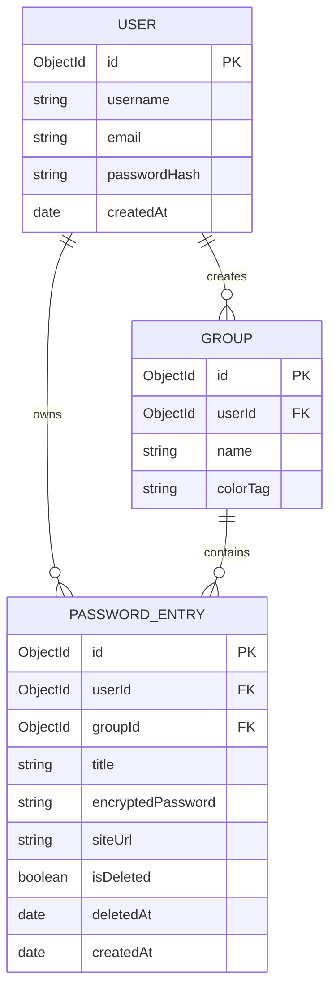

---

# 🧩 Data Relationships

```text
USER
 │
 ├───────────────┐
 │               │
 ▼               ▼
GROUP        PASSWORD_ENTRY
 │               ▲
 │               │
 └───────────────┘
```

A user can:

- Create multiple groups
- Own multiple password entries
- Organize password entries into groups

Each password entry belongs to a specific user.

---

# Password Vault Flow

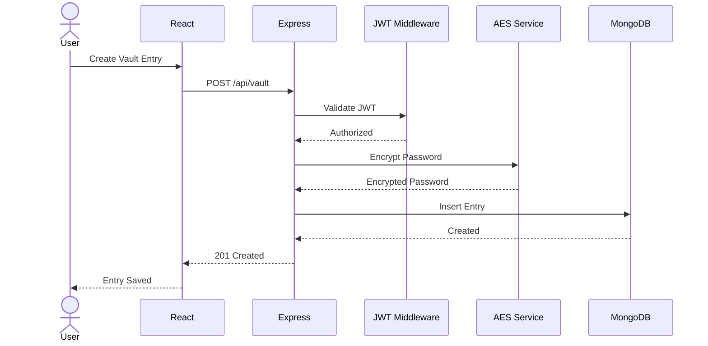

---

# 🗑️ Delete & Recovery Flow

PassGen uses soft deletion for safer credential management.

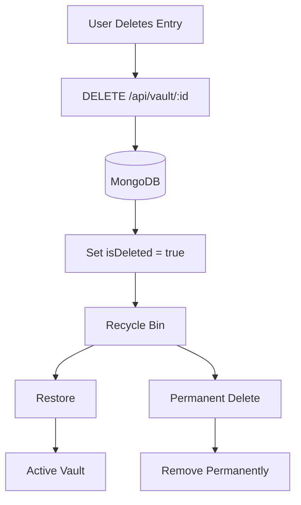

---

# Technology Stack

| Category | Technology | Purpose |
|---|---|---|
| Frontend | React.js | Component-based UI |
| Styling | Tailwind CSS | Responsive styling |
| Routing | React Router | Client-side navigation |
| State Management | Zustand | Lightweight global state |
| Backend | Node.js | Server runtime |
| API | Express.js | REST API framework |
| Authentication | JWT | Stateless authentication |
| Password Hashing | bcrypt | Secure account-password hashing |
| Encryption | Node.js crypto / AES | Vault credential encryption |
| Database | MongoDB | Persistent document storage |
| ODM | Mongoose | MongoDB schema/model management |

The original project specification identifies React, Tailwind CSS, React Router, Zustand, Node.js, Express, JWT, bcrypt, AES-based crypto, and MongoDB as the core technologies. fileciteturn0file0L208-L220

---

# Project Structure

```text
passgen/
│
├── client/
│   │
│   ├── components/
│   │   ├── Navbar/
│   │   ├── PasswordGenerator/
│   │   ├── Vault/
│   │   ├── Dashboard/
│   │   └── UI/
│   │
│   ├── pages/
│   │   ├── Login/
│   │   ├── Register/
│   │   ├── Dashboard/
│   │   ├── Vault/
│   │   └── RecycleBin/
│   │
│   └── store/
│       └── Zustand Stores
│
├── server/
│   │
│   ├── controllers/
│   │   ├── authController.js
│   │   ├── vaultController.js
│   │   ├── recycleBinController.js
│   │   └── dashboardController.js
│   │
│   ├── routes/
│   │   ├── authRoutes.js
│   │   ├── vaultRoutes.js
│   │   ├── groupRoutes.js
│   │   └── dashboardRoutes.js
│   │
│   ├── models/
│   │   ├── User.js
│   │   ├── Password.js
│   │   └── Group.js
│   │
│   ├── middleware/
│   │   └── authMiddleware.js
│   │
│   └── utils/
│       └── encryption.js
│
└── README.md
```

---

# REST API

## Authentication

| Method | Endpoint | Description | Auth |
|---|---|---|---|
| POST | `/api/auth/register` | Register user | ❌ |
| POST | `/api/auth/login` | Authenticate user | ❌ |
| DELETE | `/api/auth/account` | Delete account | ✅ |

---

## Vault

| Method | Endpoint | Description | Auth |
|---|---|---|---|
| GET | `/api/vault` | Get active vault entries | ✅ |
| POST | `/api/vault` | Create vault entry | ✅ |
| PUT | `/api/vault/:id` | Update vault entry | ✅ |
| DELETE | `/api/vault/:id` | Soft-delete entry | ✅ |

---

## Recycle Bin

| Method | Endpoint | Description | Auth |
|---|---|---|---|
| GET | `/api/vault/bin` | Get deleted entries | ✅ |
| POST | `/api/vault/bin/:id/restore` | Restore entry | ✅ |
| DELETE | `/api/vault/bin/:id` | Permanently delete entry | ✅ |

---

## Groups

| Method | Endpoint | Description | Auth |
|---|---|---|---|
| GET | `/api/groups` | Get user groups | ✅ |
| POST | `/api/groups` | Create group | ✅ |

---

## Dashboard

| Method | Endpoint | Description | Auth |
|---|---|---|---|
| GET | `/api/dashboard/stats` | Retrieve vault statistics | ✅ |

The API surface above follows the project's existing endpoint design. fileciteturn0file0L297-L313

---

# Performance & Scalability

Although PassGen is designed as a monolithic full-stack application, several architectural decisions make it suitable for further scaling.

## 1. Stateless Authentication

JWT authentication allows backend instances to remain stateless.

```text
                 Load Balancer
                 /     |     \
                /      |      \
           API #1    API #2    API #3
              \        |        /
               \       |       /
                 MongoDB
```

Any API server can process an authenticated request because authentication information is contained in the token.

---

## 2. Database Indexing

Frequently queried fields can be indexed to reduce query latency.

Potential indexes include:

```text
userId
groupId
isDeleted
createdAt
email
```

For example, retrieving active vault entries can benefit from a compound index around the user and deletion state.

---

## 3. Pagination

Large vaults should not be returned in a single request.

Instead:

```text
GET /api/vault?page=2&limit=20
```

This reduces:

- Response size
- Database workload
- Network usage
- Frontend rendering cost

---

# Scalable Architecture

For a production-scale deployment, the architecture could evolve into:

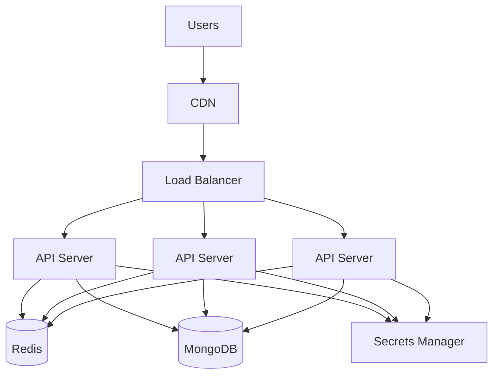

Potential additions:

- Redis caching
- Load balancing
- Docker containers
- Centralized logging
- Secrets management
- Rate limiting
- Monitoring
- Horizontal API scaling

---

# Engineering Challenges

## Challenge 1 — Secure Credential Storage

The application needs to store credentials while preventing plaintext storage.

### Approach

Use two different mechanisms:

```text
Account Password → bcrypt → Hash
Vault Password   → AES    → Ciphertext
```

This is because account passwords only need verification, whereas vault passwords must eventually be recovered for the user.

---

## Challenge 2 — Accidental Deletion

Immediately deleting credentials creates a poor recovery experience.

### Approach

Implement soft deletion:

```text
isDeleted = false
       ↓
     Delete
       ↓
isDeleted = true
       ↓
Recycle Bin
```

Users can then restore or permanently delete entries.

---

## Challenge 3 — Organizing Credentials

As the number of credentials increases, a flat list becomes difficult to navigate.

### Approach

Introduce user-defined groups:

```text
User
 ├── Work
 ├── Personal
 ├── Finance
 └── Development
```

---

## Challenge 4 — Secure API Access

Vault APIs should never be publicly accessible.

### Approach

Every protected request passes through JWT authentication middleware before reaching the controller.

---

# Future Improvements

## 🔐 Password Strength Analyzer

Add a password-strength meter based on:

- Length
- Character diversity
- Repetition
- Common-password detection

---

## 👁️ Secure Password Visibility

Allow users to temporarily reveal stored passwords through a controlled UI interaction.

---

## 🔔 Notifications

Add notifications for:

- Password updates
- Security events
- Account changes

---

## 🔑 OAuth / Google Authentication

Support additional authentication providers.

---

## 🌍 Cross-Device Synchronization

Synchronize encrypted vault data across devices.

---

## 🔒 End-to-End Encryption

A future architecture could move toward client-side encryption where the server never receives plaintext vault credentials.

```text
Client
   │
   │ Encrypt
   ▼
Ciphertext
   │
   ▼
Server
   │
   ▼
Database
```

This would provide a stronger security model than server-side encryption alone.

---

# Installation

## Prerequisites

Install:

- Node.js 18+
- npm
- MongoDB or MongoDB Atlas

---

## Clone Repository

```bash
git clone https://github.com/your-username/passgen.git

cd passgen
```

---

## Install Frontend

```bash
cd client

npm install

npm run dev
```

---

## Install Backend

Open another terminal:

```bash
cd server

npm install

npm start
```

---

# Environment Variables

Create:

```text
server/.env
```

```env
MONGO_URI=your_mongodb_connection_string

JWT_SECRET=your_jwt_secret

ENCRYPTION_KEY=your_aes_encryption_key

PORT=5000
```

### ⚠️ Important

Never commit `.env` to Git.

Add:

```gitignore
.env
node_modules/
```

---

# Screenshots

Add screenshots of the major application interfaces here.

# 📸 Screenshots

<table>
  <tr>
    <td align="center">
      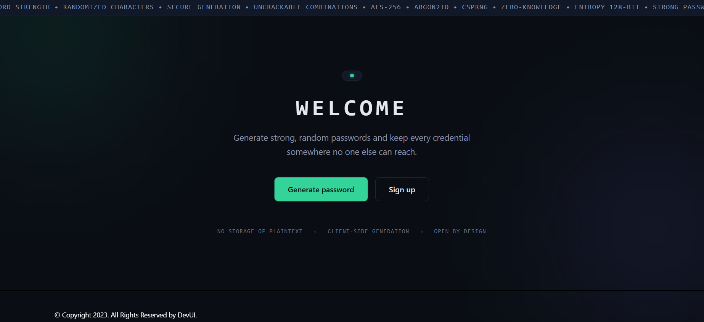
      <br/>
      <b>PassGen</b>
    </td>
    <td align="center">
      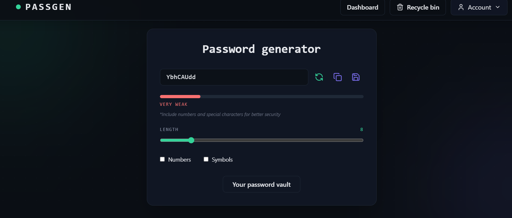
      <br/>
      <b>HomePage</b>
    </td>
    <td align="center">
      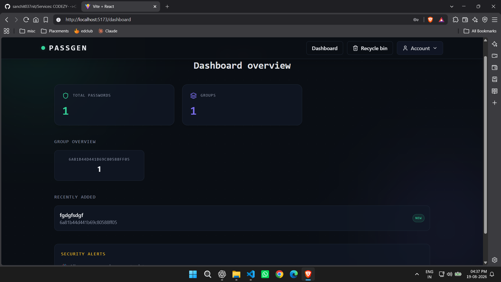
      <br/>
      <b> Dashboard</b>
    </td>
  </tr>

  <tr>
    <td align="center">
      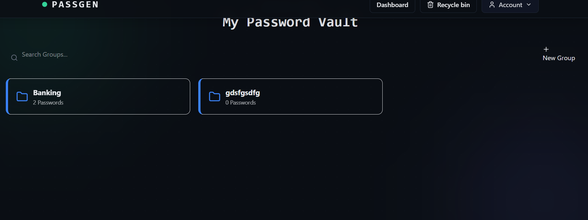
      <br/>
      <b>Groups</b>
    </td>
    <td align="center">
      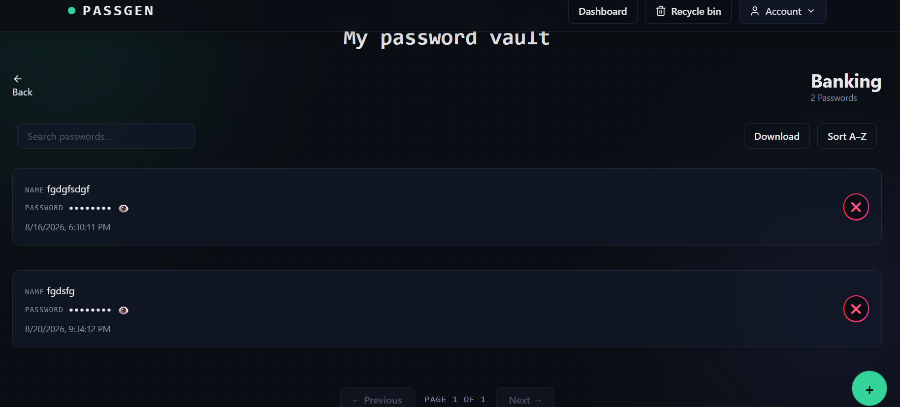
      <br/>
      <b> Password Vault</b>
    </td>
    <td align="center">
      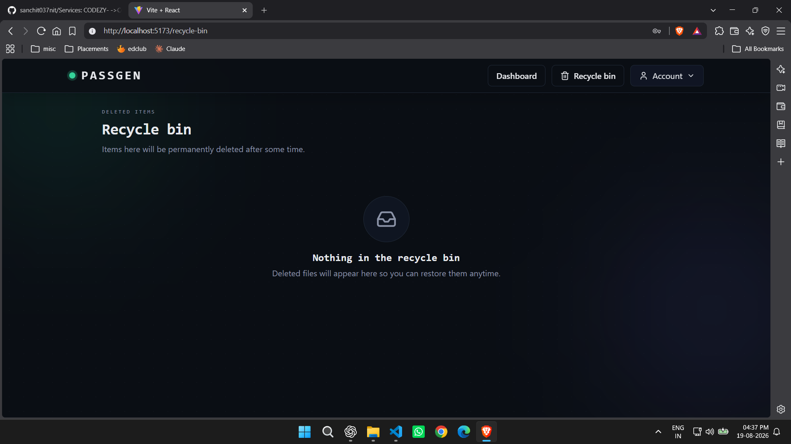
      <br/>
      <b> Recycle Bin</b>
    </td>
  </tr>
</table>

# 📊 Project Highlights

| Category | Implementation |
|---|---|
| Architecture | Client-Server / MVC |
| Frontend | React.js |
| Backend | Node.js + Express.js |
| Database | MongoDB |
| Authentication | JWT |
| Account Security | bcrypt |
| Vault Security | AES-256 |
| State Management | Zustand |
| Routing | React Router |
| Styling | Tailwind CSS |
| Data Protection | Encryption at Rest |
| Deletion Strategy | Soft Delete |
| Organization | Custom Groups |
| Analytics | Dashboard Statistics |
| API Style | REST |
| Scalability | Stateless API + Indexing + Pagination |

---

# 🏆 What This Project Demonstrates

PassGen demonstrates practical experience with:

- Full-stack web development
- REST API design
- Authentication and authorization
- Password hashing
- Symmetric encryption
- Secure credential storage
- MongoDB schema design
- Soft deletion
- State management
- CRUD operations
- Protected API routes
- Database indexing
- Pagination
- Scalable backend architecture
- Security-oriented system design

---

# Contributing

Contributions are welcome.

### 1. Fork the repository

```bash
git fork https://github.com/your-username/passgen.git
```

### 2. Create a branch

```bash
git checkout -b feature/your-feature
```

### 3. Commit changes

```bash
git commit -m "Add your feature"
```

### 4. Push changes

```bash
git push origin feature/your-feature
```

### 5. Open a Pull Request

---

# License

This project is licensed under the **MIT License**.

---

# Author

## Sanchit Virdi

**Computer Science & Engineering**

**NIT Srinagar**

PassGen was developed to explore full-stack application development while applying practical concepts in **authentication, encryption, database design, API architecture, and secure credential management**.

---

<p align="center">

### ⭐ If you found PassGen useful, consider giving the repository a star!

**Built with ❤️ and a focus on security.**

</p>
