# 🔐 PassGen — Secure Password Generator & Intelligent Credential Vault

<p align="center">

### A security-focused full-stack password manager with biometric authentication, encrypted credentials, security analytics, audit logging, and AI-assisted password insights.

</p>

<p align="center">

**Generate → Protect → Organize → Monitor → Recover → Secure**

</p>

<p align="center">


</p>

---

<a name="table-of-contents"></a>

# 📌 Table of Contents

* [Overview](#overview)
* [Why PassGen?](#why-passgen)
* [Problem Statement](#problem-statement)
* [Solution](#solution)
* [Key Features](#key-features)

  * [Password Generator](#password-generator)
  * [Secure Credential Vault](#secure-credential-vault)
  * [Password Groups](#password-groups)
  * [Recycle Bin](#recycle-bin)
  * [Dashboard & Vault Analytics](#dashboard--vault-analytics)
  * [Password Strength Analysis](#password-strength-analysis)
  * [Biometric Authentication](#biometric-authentication)
  * [Login Security & Account Lockout](#login-security--account-lockout)
  * [Audit Logging](#audit-logging)
  * [Security Alerts](#security-alerts)
  * [Password Export](#password-export)
  * [AI-Powered Password Insights](#ai-powered-password-insights)
* [System Architecture](#system-architecture)
* [Security Architecture](#security-architecture)
* [Encryption Architecture](#encryption-architecture)
* [Authentication Architecture](#authentication-architecture)
* [Biometric Authentication Flow](#biometric-authentication-flow)
* [Login Lockout Flow](#login-lockout-flow)
* [Password Vault Flow](#password-vault-flow)
* [Password Lifecycle](#password-lifecycle)
* [Audit Logging Flow](#audit-logging-flow)
* [AI Security Insights Flow](#ai-security-insights-flow)
* [Database Design](#database-design)
* [Database Indexing](#database-indexing)
* [API Architecture](#api-architecture)
* [API Endpoints](#api-endpoints)
* [Rate Limiting](#rate-limiting)
* [Frontend Architecture](#frontend-architecture)
* [State Management](#state-management)
* [Project Structure](#project-structure)
* [Technology Stack](#technology-stack)
* [Security Design Decisions](#security-design-decisions)
* [Performance & Scalability](#performance--scalability)
* [Production-Scale Architecture](#production-scale-architecture)
* [Environment Variables](#environment-variables)
* [Installation](#installation)
* [Running the Application](#running-the-application)
* [Screenshots](#screenshots)
* [Engineering Challenges](#engineering-challenges)
* [Future Improvements](#future-improvements)
* [Contributing](#contributing)
* [License](#license)
* [Author](#author)
* [Project Summary](#project-summary)

---

<a name="overview"></a>

# 🚀 Overview

**PassGen** is a full-stack password generation and credential-management platform designed around practical application security.

The project started as a password generator and evolved into a complete credential-management system with:

* Secure password generation
* Password vault
* Custom credential groups
* JWT authentication
* Biometric/WebAuthn authentication
* Password hashing
* Client-side cryptographic utilities
* AES-GCM encryption
* Login attempt tracking
* Temporary account lockout
* Audit logs
* Security alerts
* Password strength analysis
* Vault analytics
* Password recovery through soft deletion
* Permanent deletion
* Password export
* API rate limiting
* AI-assisted password insights

The application follows a modular **React + Node.js + Express + MongoDB** architecture.

---

<a name="why-passgen"></a>

# 💡 Why PassGen?

Password managers have two fundamentally different responsibilities:

```text
                PASSGEN
                   │
        ┌──────────┴──────────┐
        │                     │
        ▼                     ▼
  Generate Secrets       Protect Secrets
        │                     │
        ▼                     ▼
 Strong Randomness       Authentication
 Password Strength       Encryption
                         Access Control
                         Audit Logs
                         Recovery
```

PassGen therefore focuses not only on generating passwords, but also on the **entire lifecycle of credentials**.

```text
Generate
   ↓
Store
   ↓
Organize
   ↓
Access Securely
   ↓
Monitor
   ↓
Update
   ↓
Delete
   ↓
Recover / Permanently Delete
```

---

<a name="problem-statement"></a>

# 🎯 Problem Statement

As users create more online accounts, password management becomes increasingly difficult.

Common approaches include:

* Reusing passwords
* Using simple passwords
* Saving credentials in notes
* Maintaining text files
* Keeping credentials in browser notes
* Scattering credentials across multiple systems

These approaches introduce several problems.

| Problem                  | Impact                                                     |
| ------------------------ | ---------------------------------------------------------- |
| Weak passwords           | Easier credential compromise                               |
| Password reuse           | One compromised password can affect multiple accounts      |
| Scattered credentials    | Difficult retrieval and organization                       |
| Accidental deletion      | Important credentials can be lost                          |
| No password analysis     | Users may not know which credentials are weak              |
| No audit history         | Suspicious account activity becomes harder to investigate  |
| Weak authentication      | Password-only access creates a single authentication layer |
| Unlimited login attempts | Increases exposure to brute-force attacks                  |

PassGen addresses these problems through a combination of **secure credential storage, authentication controls, monitoring, recovery mechanisms, and security-oriented backend design**.

---

<a name="solution"></a>

# 🧩 Solution

PassGen combines several security-oriented subsystems into a single platform.

```text
                           PASSGEN
                              │
          ┌───────────────────┼───────────────────┐
          │                   │                   │
          ▼                   ▼                   ▼
    Password Engine       Secure Vault       Security Layer
          │                   │                   │
          ▼                   ▼                   ▼
     Generation          Encryption          JWT / WebAuthn
     Strength            Groups              Rate Limiting
     Analysis            Recovery            Lockout
                                             Audit Logs
          │                   │                   │
          └───────────────────┼───────────────────┘
                              ▼
                       Security Dashboard
```

---

<a name="key-features"></a>

# ✨ Key Features

<a name="password-generator"></a>

## 🔑 Password Generator

PassGen generates random passwords with configurable options.

Features include:

* Custom password length
* Numbers
* Symbols
* One-click regeneration
* Clipboard copy
* Password strength evaluation

The original UI supports password lengths from **6–20 characters**.

---

<a name="secure-credential-vault"></a>

## 💾 Secure Credential Vault

Authenticated users can:

* Create credentials
* View credentials
* Update credentials
* Delete credentials
* Organize credentials
* Restore deleted credentials
* Permanently delete credentials

A credential contains information such as:

```text
Credential
│
├── Name
├── Password
├── Description
├── Group
├── Owner
├── Created At
├── Updated At
└── Deleted State
```

---

<a name="password-groups"></a>

## 🗂️ Password Groups

Credentials can be organized into custom groups.

Example:

```text
My Vault
│
├── Development
│   ├── GitHub
│   ├── AWS
│   └── Jira
│
├── Personal
│   ├── Gmail
│   ├── Amazon
│   └── Netflix
│
└── Finance
    ├── Banking
    └── Payments
```

Groups can also be deleted, allowing users to maintain the vault hierarchy over time.

---

<a name="recycle-bin"></a>

## 🗑️ Recycle Bin

PassGen uses **soft deletion** instead of immediately destroying credentials.

```text
Delete Credential
       │
       ▼
deleted = true
       │
       ▼
Recycle Bin
       │
       ├──────────────┐
       ▼              ▼
    Restore      Delete Forever
       │              │
       ▼              ▼
   Active Vault    Permanent Removal
```

This provides protection against accidental deletion.

---

<a name="dashboard--vault-analytics"></a>

## 📊 Dashboard & Vault Analytics

The dashboard provides a centralized view of vault activity.

It can expose information such as:

* Total credentials
* Group distribution
* Recently created credentials
* Password activity
* Security-related information

The project includes a dedicated dashboard page and vault analytics implementation.

---

<a name="password-strength-analysis"></a>

## 📈 Password Strength Analysis

PassGen integrates `zxcvbn` to estimate password strength.

```text
Password
   │
   ▼
zxcvbn
   │
   ├── Strength Score
   ├── Pattern Analysis
   ├── Guessability
   └── Feedback
```

This allows the application to provide more meaningful strength feedback than simply checking password length.

---

<a name="biometric-authentication"></a>

## 👆 Biometric Authentication

PassGen has evolved beyond password-only authentication.

The latest authentication work integrates **WebAuthn/passkey-style browser authentication** using:

* `@simplewebauthn/browser`
* `@simplewebauthn/server`

This enables supported devices to authenticate using platform authenticators such as:

* Fingerprint
* Device biometric authentication
* Platform passkeys

Conceptually:

```text
User
 │
 ▼
Browser WebAuthn API
 │
 ▼
Platform Authenticator
 │
 ▼
Fingerprint / Device Authentication
 │
 ▼
Cryptographic Assertion
 │
 ▼
Backend Verification
 │
 ▼
Authenticated Session
```

The user model stores a WebAuthn challenge used during the authentication process.

---

<a name="login-security--account-lockout"></a>

## 🛡️ Login Security & Account Lockout

PassGen tracks failed login attempts.

The current authentication model includes:

```text
loginAttempts
lockUntil
```

After repeated failed attempts, the account can be temporarily locked.

The current implementation locks an account after **5 failed attempts for 15 minutes**.

```text
Login Attempt
     │
     ▼
Password Verification
     │
     ├── Success ───────► Reset / Continue
     │
     └── Failure
          │
          ▼
     Increment Attempts
          │
          ▼
      Attempts >= 5?
          │
       ┌──┴──┐
       │     │
      No    Yes
       │     │
       ▼     ▼
    Retry   Lock 15 min
```

This adds an additional layer against repeated credential-guessing attempts.

---

<a name="audit-logging"></a>

## 📝 Audit Logging

PassGen maintains audit records for important security-related events.

An audit record contains:

```text
AuditLog
│
├── User
├── Action
├── Resource ID
├── Details
└── Created At
```

Examples of logged actions include:

```text
LOGIN SUCCESSFULL
LOGOUT SUCCESSFULL
ACCOUNT LOCKED
```

This provides a foundation for security investigation and account activity tracking.

---

<a name="security-alerts"></a>

## 🚨 Security Alerts

The application exposes a security-alert endpoint for authenticated users.

Security monitoring can be used to surface potentially important events related to the user's credentials.

```text
User
 │
 ▼
Security Alerts API
 │
 ▼
Analyze Vault Activity
 │
 ▼
Security Findings
 │
 ▼
Dashboard
```

---

<a name="password-export"></a>

## 📄 Password Export

PassGen provides a protected password-download/export endpoint.

The backend uses `pdfkit` as part of the current dependency set, supporting document-based password export functionality.

Export operations are also rate-limited to prevent uncontrolled repeated requests.

---

<a name="ai-powered-password-insights"></a>

## 🤖 AI-Powered Password Insights

The latest backend includes the **Groq SDK** and an AI-related password-analysis endpoint.

PassGen exposes a `/roast` operation that can be used to generate AI-assisted commentary about password/security characteristics.

Conceptually:

```text
Password / Security Context
          │
          ▼
       Backend
          │
          ▼
      Groq SDK
          │
          ▼
      LLM Analysis
          │
          ▼
 Security Feedback
```

The AI functionality is treated as an additional insight layer rather than as the underlying security mechanism.

---

<a name="system-architecture"></a>

# 🏗️ System Architecture

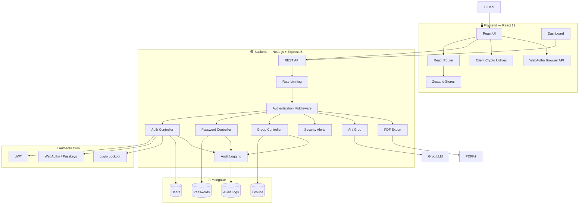
```mermaid
flowchart TB

    USER["👤 User"]

    subgraph FRONTEND["🖥️ Frontend — React 19"]
        UI["React UI"]
        ROUTER["React Router"]
        STORE["Zustand Stores"]
        CRYPTO["Client Crypto Utilities"]
        WEB_AUTHN["WebAuthn Browser API"]
        ANALYTICS["Dashboard"]
    end

    subgraph BACKEND["🟢 Backend — Node.js + Express 5"]
        API["REST API"]
        AUTH["Authentication Middleware"]
        RATE["Rate Limiting"]
        AUTHCTRL["Auth Controller"]
        PASSCTRL["Password Controller"]
        GROUPCTRL["Group Controller"]
        AUDIT["Audit Logging"]
        SECURITY["Security Alerts"]
        AI["AI / Groq"]
        EXPORT["PDF Export"]
    end

    subgraph DATABASE["🍃 MongoDB"]
        USERS[(Users)]
        PASSWORDS[(Passwords)]
        GROUPS[(Groups)]
        AUDITLOGS[(Audit Logs)]
    end

    subgraph AUTH_SYSTEM["🔐 Authentication"]
        JWT["JWT"]
        WEBAUTHN["WebAuthn / Passkeys"]
        LOCKOUT["Login Lockout"]
    end

    USER --> UI

    UI --> ROUTER
    ROUTER --> STORE

    UI --> API
    UI --> CRYPTO
    UI --> WEB_AUTHN

    API --> RATE
    RATE --> AUTH

    AUTH --> AUTHCTRL
    AUTH --> PASSCTRL
    AUTH --> GROUPCTRL
    AUTH --> SECURITY
    AUTH --> AI
    AUTH --> EXPORT

    AUTHCTRL --> JWT
    AUTHCTRL --> WEBAUTHN
    AUTHCTRL --> LOCKOUT

    AUTHCTRL --> USERS
    PASSCTRL --> PASSWORDS
    GROUPCTRL --> GROUPS

    AUTHCTRL --> AUDIT
    PASSCTRL --> AUDIT
    GROUPCTRL --> AUDIT

    AUDIT --> AUDITLOGS

    AI --> GROQ["Groq LLM"]
    EXPORT --> PDF["PDFKit"]

    ANALYTICS --> API
```

---

<a name="security-architecture"></a>

# 🔐 Security Architecture

Security is implemented as multiple independent layers.

```text
                         PASSGEN SECURITY
                               │
          ┌────────────────────┼────────────────────┐
          │                    │                    │
          ▼                    ▼                    ▼
   Authentication         Credential Data       API Protection
          │                    │                    │
          ├── JWT              ├── Encryption      ├── Rate Limits
          ├── WebAuthn         ├── Client Crypto   ├── Protected Routes
          └── Lockout          └── Secure Storage  └── Validation
                               │
                               ▼
                       Security Monitoring
                               │
                  ┌────────────┼────────────┐
                  ▼            ▼            ▼
              Audit Logs   Alerts       Analytics
```

---

<a name="encryption-architecture"></a>

# 🔒 Encryption Architecture

A key architectural distinction is made between:

### Authentication Passwords

Passwords used to authenticate the account should be represented using a password-hashing mechanism.

```text
Account Password
      │
      ▼
    bcrypt
      │
      ▼
Password Hash
      │
      ▼
MongoDB
```

The original password is not recovered from the hash.

### Vault Credentials

Vault credentials must eventually be recoverable by the authorized user, so encryption is used rather than one-way password hashing.

The current frontend includes a cryptographic utility using the browser Web Crypto API with:

* PBKDF2
* SHA-256
* AES-GCM
* 256-bit derived keys

Conceptually:

```text
User Secret
    │
    ▼
PBKDF2 + SHA-256
    │
    ▼
Derived AES-256 Key
    │
    ▼
AES-GCM
    │
    ▼
Encrypted Credential
```

The implementation derives the cryptographic key from user material and an email-derived salt, with PBKDF2 configured for 100,000 iterations and AES-GCM using a 256-bit key.

---

<a name="authentication-architecture"></a>

# 🔑 Authentication Architecture

PassGen supports multiple authentication mechanisms.

```text
                    Authentication
                          │
             ┌────────────┴────────────┐
             │                         │
             ▼                         ▼
       Password Login            WebAuthn Login
             │                         │
             ▼                         ▼
          bcrypt                 Device Authenticator
             │                         │
             ▼                         ▼
           JWT                  Cryptographic Assertion
             │                         │
             └────────────┬────────────┘
                          ▼
                   Authenticated User
```

JWT is used for stateless authenticated API access.

WebAuthn provides an additional passwordless/biometric-capable authentication mechanism on supported devices.

---

<a name="biometric-authentication-flow"></a>

# 👆 Biometric Authentication Flow

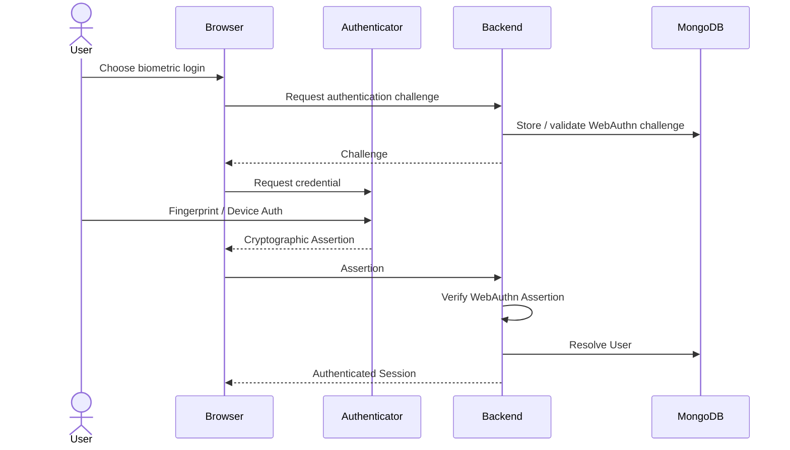
```mermaid
sequenceDiagram

    actor User
    participant Browser
    participant Authenticator
    participant Backend
    participant DB as MongoDB

    User->>Browser: Choose biometric login

    Browser->>Backend: Request authentication challenge

    Backend->>DB: Store / validate WebAuthn challenge

    Backend-->>Browser: Challenge

    Browser->>Authenticator: Request credential

    User->>Authenticator: Fingerprint / Device Auth

    Authenticator-->>Browser: Cryptographic Assertion

    Browser->>Backend: Assertion

    Backend->>Backend: Verify WebAuthn Assertion

    Backend->>DB: Resolve User

    Backend-->>Browser: Authenticated Session
```

The current user schema contains a `webauthnChallenge` field for the authentication flow.

---

<a name="login-lockout-flow"></a>

# 🚫 Login Lockout Flow

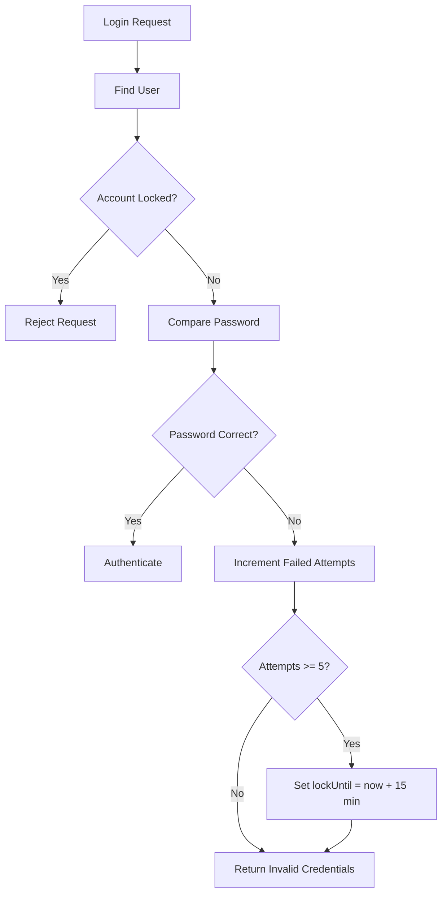
```mermaid
flowchart TD

    A["Login Request"]

    B["Find User"]

    C{"Account Locked?"}

    D["Reject Request"]

    E["Compare Password"]

    F{"Password Correct?"}

    G["Authenticate"]

    H["Increment Failed Attempts"]

    I{"Attempts >= 5?"}

    J["Set lockUntil = now + 15 min"]

    K["Return Invalid Credentials"]

    A --> B
    B --> C

    C -->|Yes| D
    C -->|No| E

    E --> F

    F -->|Yes| G
    F -->|No| H

    H --> I

    I -->|No| K
    I -->|Yes| J

    J --> K
```

---

<a name="password-vault-flow"></a>

# 💾 Password Vault Flow

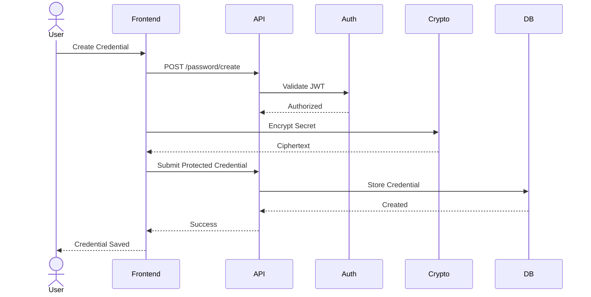
```mermaid
sequenceDiagram

    actor User
    participant Frontend
    participant API
    participant Auth
    participant Crypto
    participant DB

    User->>Frontend: Create Credential

    Frontend->>API: POST /password/create

    API->>Auth: Validate JWT

    Auth-->>API: Authorized

    Frontend->>Crypto: Encrypt Secret

    Crypto-->>Frontend: Ciphertext

    Frontend->>API: Submit Protected Credential

    API->>DB: Store Credential

    DB-->>API: Created

    API-->>Frontend: Success

    Frontend-->>User: Credential Saved
```

---

<a name="password-lifecycle"></a>

# 🔄 Password Lifecycle

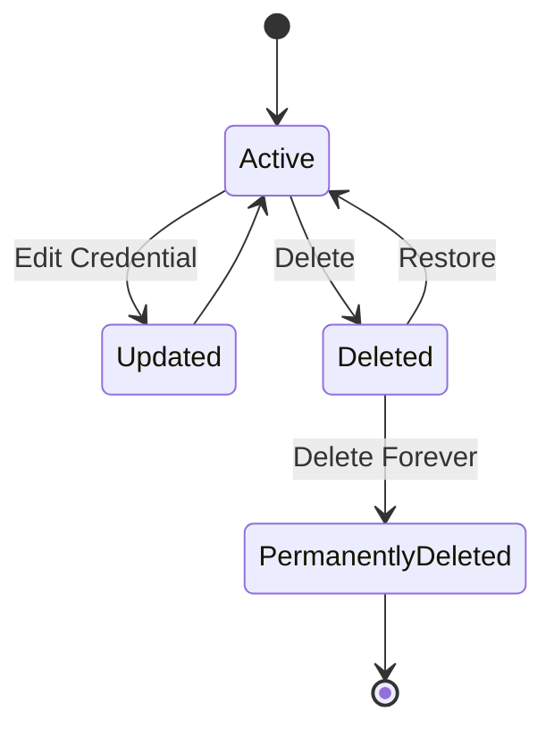
```mermaid
stateDiagram-v2

    [*] --> Active

    Active --> Updated: Edit Credential

    Updated --> Active

    Active --> Deleted: Delete

    Deleted --> Active: Restore

    Deleted --> PermanentlyDeleted: Delete Forever

    PermanentlyDeleted --> [*]
```

The underlying password model tracks:

* `deleted`
* `deletedAt`
* `passwordUpdatedAt`
* `createdAt`
* `updatedAt`

The model also contains indexes supporting user-based retrieval and deleted-state filtering.

---

<a name="audit-logging-flow"></a>

# 📝 Audit Logging Flow

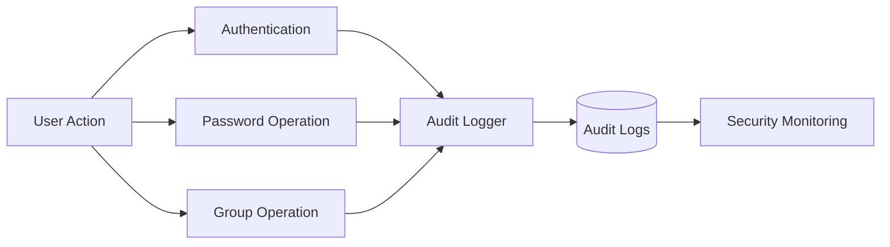
```mermaid
flowchart LR

    USER["User Action"]

    AUTH["Authentication"]

    PASS["Password Operation"]

    GROUP["Group Operation"]

    AUDIT["Audit Logger"]

    DB[(Audit Logs)]

    ALERT["Security Monitoring"]

    USER --> AUTH
    USER --> PASS
    USER --> GROUP

    AUTH --> AUDIT
    PASS --> AUDIT
    GROUP --> AUDIT

    AUDIT --> DB
    DB --> ALERT
```

Audit records contain:

```text
user
action
resourceId
details
createdAt
```

This allows the platform to retain a structured history of security-relevant actions.

---

<a name="ai-security-insights-flow"></a>

# 🤖 AI Security Insights Flow

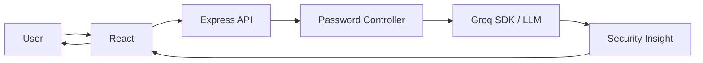
```mermaid
flowchart LR

    USER["User"]

    FRONTEND["React"]

    API["Express API"]

    CONTROLLER["Password Controller"]

    GROQ["Groq SDK / LLM"]

    RESPONSE["Security Insight"]

    USER --> FRONTEND
    FRONTEND --> API
    API --> CONTROLLER
    CONTROLLER --> GROQ
    GROQ --> RESPONSE
    RESPONSE --> FRONTEND
    FRONTEND --> USER
```

The AI layer is supplementary.

Security-critical operations should remain deterministic and enforced by the backend rather than delegated to an LLM.

---

<a name="database-design"></a>

# 🗄️ Database Design

The application uses MongoDB with Mongoose.

The core data model consists of:

```text
User
 │
 ├── Passwords
 │
 ├── Groups
 │
 └── Audit Logs
```

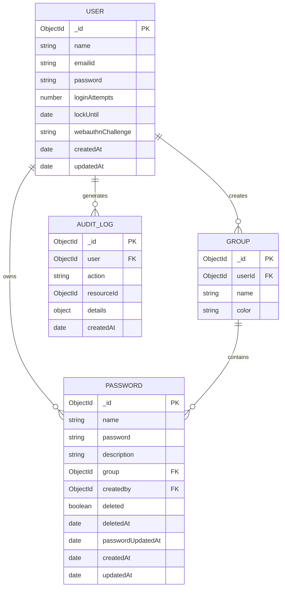
```mermaid
erDiagram

    USER ||--o{ PASSWORD : owns
    USER ||--o{ GROUP : creates
    USER ||--o{ AUDIT_LOG : generates

    GROUP ||--o{ PASSWORD : contains

    USER {
        ObjectId _id PK
        string name
        string emailid
        string password
        number loginAttempts
        date lockUntil
        string webauthnChallenge
        date createdAt
        date updatedAt
    }

    PASSWORD {
        ObjectId _id PK
        string name
        string password
        string description
        ObjectId group FK
        ObjectId createdby FK
        boolean deleted
        date deletedAt
        date passwordUpdatedAt
        date createdAt
        date updatedAt
    }

    GROUP {
        ObjectId _id PK
        ObjectId userId FK
        string name
        string color
    }

    AUDIT_LOG {
        ObjectId _id PK
        ObjectId user FK
        string action
        ObjectId resourceId
        object details
        date createdAt
    }
```

---

<a name="database-indexing"></a>

# ⚡ Database Indexing

The password model currently includes indexes around common access patterns.

```text
Index 1:
createdby

Index 2:
createdby + deleted

Index 3:
createdby + createdAt DESC
```

These indexes support operations such as:

```text
Get user's credentials
        ↓
Filter active/deleted credentials
        ↓
Sort recent credentials
```

This is particularly useful for dashboard and vault queries.

---

<a name="api-architecture"></a>

# 🌐 API Architecture

The backend follows a modular REST API architecture.

```text
HTTP Request
     │
     ▼
Express Router
     │
     ▼
Rate Limiter
     │
     ▼
Authentication Middleware
     │
     ▼
Controller
     │
     ├── MongoDB
     ├── Audit Log
     ├── Encryption
     ├── PDF Export
     └── Groq
     │
     ▼
JSON Response
```

---

<a name="api-endpoints"></a>

# 📡 API Endpoints

## Authentication

| Method | Endpoint                  | Purpose        | Protected |
| ------ | ------------------------- | -------------- | --------- |
| POST   | `/api/auth/signup`        | Create account | ❌         |
| POST   | `/api/auth/login`         | Login          | ❌         |
| POST   | `/api/auth/logout`        | Logout         | ✅         |
| DELETE | `/api/auth/deleteaccount` | Delete account | ✅         |

---

## Passwords

| Method | Endpoint                      | Purpose                | Protected |
| ------ | ----------------------------- | ---------------------- | --------- |
| POST   | `/api/pass/create`            | Create password        | ✅         |
| GET    | `/api/pass/get/:userId`       | Retrieve credentials   | ✅         |
| GET    | `/api/pass/view/:id`          | View credential        | ✅         |
| PATCH  | `/api/pass/update/:id`        | Update credential      | ✅         |
| DELETE | `/api/pass/delete/:id`        | Soft-delete credential | ✅         |
| DELETE | `/api/pass/deleteforever/:id` | Permanent deletion     | ✅         |
| PATCH  | `/api/pass/restore/:id`       | Restore credential     | ✅         |

---

## Recycle Bin

| Method | Endpoint                      | Purpose                 |
| ------ | ----------------------------- | ----------------------- |
| GET    | `/api/pass/recycle/:userId`   | Get deleted credentials |
| PATCH  | `/api/pass/restore/:id`       | Restore credential      |
| DELETE | `/api/pass/deleteforever/:id` | Permanently delete      |

---

## Dashboard

| Method | Endpoint                      | Purpose             |
| ------ | ----------------------------- | ------------------- |
| GET    | `/api/pass/dashboard/:userId` | Dashboard analytics |

---

## Security

| Method | Endpoint                    | Purpose                               |
| ------ | --------------------------- | ------------------------------------- |
| GET    | `/api/pass/security-alerts` | Retrieve security alerts              |
| POST   | `/api/pass/roast`           | Generate AI-assisted password insight |

---

## Export

| Method | Endpoint                     | Purpose           |
| ------ | ---------------------------- | ----------------- |
| GET    | `/api/pass/download/:userId` | Export vault data |

---

<a name="rate-limiting"></a>

# 🛡️ Rate Limiting

The current password routes include dedicated rate limiters for sensitive operations.

Examples include:

```text
createPasswordLimiter
updatePasswordLimiter
deletePasswordLimiter
exportLimiter
```

Architecture:

```text
Request
   │
   ▼
Rate Limiter
   │
   ├── Limit Exceeded → 429
   │
   └── Allowed
          │
          ▼
      JWT Middleware
          │
          ▼
       Controller
```

Rate limiting is particularly useful for:

* Credential creation
* Credential modification
* Credential deletion
* Export operations

---

<a name="frontend-architecture"></a>

# 🖥️ Frontend Architecture

The frontend is built using React 19 and Vite.

Major technologies include:

* React 19
* React Router 7
* Zustand
* Tailwind CSS 4
* Framer Motion
* Axios
* Lucide React
* React Hot Toast
* WebAuthn Browser API
* Web Crypto API

The frontend is responsible for:

```text
UI
│
├── Authentication
├── Password Generator
├── Password Vault
├── Groups
├── Dashboard
├── Recycle Bin
├── Security Alerts
├── Password Export
└── Biometric Authentication
```

---

<a name="state-management"></a>

# ⚡ State Management

PassGen uses Zustand for lightweight global state management.

The current frontend contains dedicated stores for authentication and password state.

Conceptually:

```text
Zustand
│
├── Auth Store
│   ├── User
│   ├── Authentication State
│   └── Session
│
└── Password Store
    ├── Passwords
    ├── Groups
    ├── Recycle Bin
    └── Dashboard Data
```

This keeps shared application state separate from individual React components.

---

<a name="project-structure"></a>

# 📂 Project Structure

```text
random-pass/
│
├── random-password generator/
│   │
│   ├── frontend/
│   │   ├── src/
│   │   │   ├── components/
│   │   │   ├── pages/
│   │   │   ├── store/
│   │   │   ├── lib/
│   │   │   │   └── crypto.js
│   │   │   └── ...
│   │   │
│   │   ├── package.json
│   │   └── vite.config.js
│   │
│   ├── backend/
│   │   ├── src/
│   │   │   ├── controllers/
│   │   │   │   ├── authcontroller.js
│   │   │   │   ├── passcontroller.js
│   │   │   │   └── group.controller.js
│   │   │   │
│   │   │   ├── middleware/
│   │   │   │   ├── authmiddleware.js
│   │   │   │   └── ratelimiter.js
│   │   │   │
│   │   │   ├── models/
│   │   │   │   ├── user.model.js
│   │   │   │   ├── pass.model.js
│   │   │   │   └── auditlogs.model.js
│   │   │   │
│   │   │   └── routes/
│   │   │       └── pass.routes.js
│   │   │
│   │   ├── unlock.js
│   │   ├── test_or.js
│   │   ├── package.json
│   │   └── index.js
│   │
│   └── ...
│
├── screenshots/
│
├── .gitignore
│
└── README.md
```

---

<a name="technology-stack"></a>

# 🛠️ Technology Stack

| Category             | Technology             |
| -------------------- | ---------------------- |
| UI                   | React 19               |
| Build Tool           | Vite                   |
| Routing              | React Router 7         |
| State Management     | Zustand 5              |
| Styling              | Tailwind CSS 4         |
| Animation            | Framer Motion          |
| HTTP Client          | Axios                  |
| Icons                | Lucide React           |
| Notifications        | React Hot Toast        |
| Backend              | Node.js                |
| API Framework        | Express 5              |
| Database             | MongoDB                |
| ODM                  | Mongoose 8             |
| Authentication       | JWT                    |
| Password Hashing     | bcryptjs               |
| Biometric Auth       | WebAuthn               |
| WebAuthn Client      | SimpleWebAuthn Browser |
| WebAuthn Server      | SimpleWebAuthn Server  |
| Client Crypto        | Web Crypto API         |
| Key Derivation       | PBKDF2                 |
| Symmetric Encryption | AES-GCM                |
| Password Analysis    | zxcvbn                 |
| API Protection       | express-rate-limit     |
| AI                   | Groq SDK               |
| PDF Export           | PDFKit                 |
| Development          | Nodemon                |
| Deployment           | Vercel + Render        |

---

<a name="security-design-decisions"></a>

# 🧠 Security Design Decisions

## Why bcrypt for account passwords?

Account passwords are used only for authentication.

Therefore, they should be stored as one-way password hashes.

```text
Password
   ↓
bcrypt
   ↓
Hash
   ↓
Database
```

During login:

```text
Input Password
      ↓
bcrypt.compare()
      ↓
Stored Hash
      ↓
Match?
```

---

## Why encryption for vault credentials?

Unlike account passwords, vault credentials need to be recovered for authorized use.

Therefore:

```text
Hashing
→ One-way
→ Cannot recover original secret

Encryption
→ Reversible with key
→ Suitable for recoverable vault credentials
```

---

## Why WebAuthn?

Password authentication creates a dependency on a memorized secret.

WebAuthn allows the browser/device authenticator to perform cryptographic authentication.

```text
User
 ↓
Device Authenticator
 ↓
Cryptographic Signature
 ↓
Server Verification
```

The server does not need to receive the user's raw biometric data.

---

## Why account lockout?

Without a login-attempt limit:

```text
Attacker
   ↓
Password Guess
   ↓
Password Guess
   ↓
Password Guess
   ↓
...
```

With lockout:

```text
Failed Login
    ↓
Attempt Counter
    ↓
5 Failures
    ↓
15-Minute Lock
```

---

## Why audit logs?

Authentication and credential-management applications benefit from traceability.

Audit records provide:

```text
Who?
What?
Which Resource?
When?
Additional Details?
```

This creates a foundation for security monitoring and incident investigation.

---

## Why rate limiting?

Authentication and credential APIs are security-sensitive.

Rate limiting reduces uncontrolled request volume against endpoints such as:

```text
Create Password
Update Password
Delete Password
Export Vault
```

---

<a name="performance--scalability"></a>

# ⚡ Performance & Scalability

PassGen is currently a modular monolithic application, but its architecture allows incremental scaling.

### Current optimization mechanisms

* MongoDB indexes
* Stateless JWT authentication
* Dedicated rate limiters
* Efficient client-side state management
* Paginated/filtered data patterns
* Separation of frontend and backend
* Database query optimization

---

## Database Query Optimization

The password model includes indexes for:

```text
createdby
createdby + deleted
createdby + createdAt DESC
```

These support common operations such as:

```text
User Vault
   ↓
Filter by User
   ↓
Filter Active/Deleted
   ↓
Sort by Creation Time
```

---

<a name="production-scale-architecture"></a>

# 🏗️ Production-Scale Architecture

A larger deployment could evolve into:

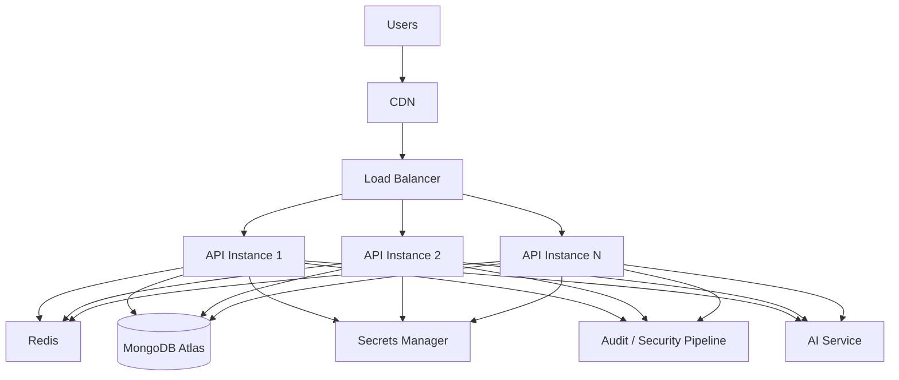
```mermaid
flowchart TD

    USER["Users"]

    CDN["CDN"]

    LB["Load Balancer"]

    API1["API Instance 1"]
    API2["API Instance 2"]
    API3["API Instance N"]

    REDIS["Redis"]

    MONGO[("MongoDB Atlas")]

    SECRETS["Secrets Manager"]

    AUDIT["Audit / Security Pipeline"]

    AI["AI Service"]

    USER --> CDN
    CDN --> LB

    LB --> API1
    LB --> API2
    LB --> API3

    API1 --> REDIS
    API2 --> REDIS
    API3 --> REDIS

    API1 --> MONGO
    API2 --> MONGO
    API3 --> MONGO

    API1 --> SECRETS
    API2 --> SECRETS
    API3 --> SECRETS

    API1 --> AUDIT
    API2 --> AUDIT
    API3 --> AUDIT

    API1 --> AI
    API2 --> AI
    API3 --> AI
```

Potential infrastructure additions:

* Redis
* Load balancing
* Centralized logging
* Secrets Manager
* Monitoring
* Alerting
* Containerization
* Background workers
* Message queues
* Dedicated AI service

---

<a name="environment-variables"></a>

# 🔑 Environment Variables

Create:

```text
random-password generator/backend/.env
```

Example:

```env
MONGODB_URL=your_mongodb_connection_string

JWT_SECRET=your_jwt_secret

ENCRYPTION_KEY=your_encryption_key

GROQ_API_KEY=your_groq_api_key

PORT=5000
```

> Use the exact environment-variable names expected by the current implementation. Never commit secrets to GitHub.

Recommended `.gitignore`:

```gitignore
.env
node_modules/
dist/
```

---

<a name="installation"></a>

# ⚙️ Installation

## Prerequisites

Install:

* Node.js
* npm
* MongoDB / MongoDB Atlas
* A browser supporting WebAuthn for biometric authentication

---

## Clone Repository

```bash
git clone https://github.com/sanchit037nit/random-pass.git

cd random-pass
```

---

## Frontend Setup

```bash
cd "random-password generator/frontend"

npm install

npm run dev
```

---

## Backend Setup

Open another terminal:

```bash
cd "random-password generator/backend"

npm install

npm run dev
```

For production-style startup:

```bash
npm start
```

---

<a name="running-the-application"></a>

# ▶️ Running the Application

The development architecture runs two services:

```text
Frontend
   │
   │ HTTP
   ▼
Backend
   │
   ▼
MongoDB
```

Typical development setup:

```text
React / Vite
http://localhost:5173

        ↓

Express API
http://localhost:5000

        ↓

MongoDB Atlas
```

For WebAuthn functionality, ensure the application is served in an environment compatible with browser credential APIs and the configured WebAuthn origin/RP settings.

---

<a name="screenshots"></a>

# 📸 Screenshots

The repository contains application screenshots under the `screenshots/` directory.

Suggested README presentation:

<table>
  <tr>
    <td align="center">
      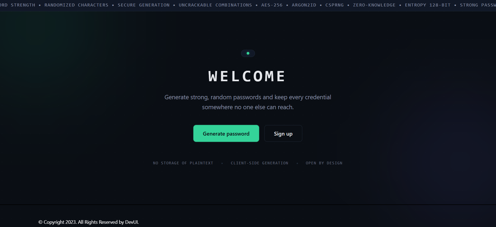
      <br/>
      <b>PassGen</b>
    </td>
    <td align="center">
      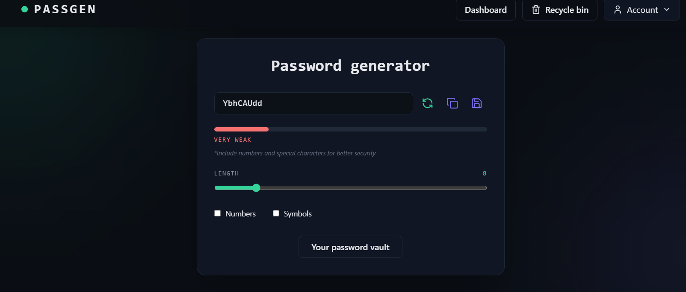
      <br/>
      <b>Home</b>
    </td>
    <td align="center">
      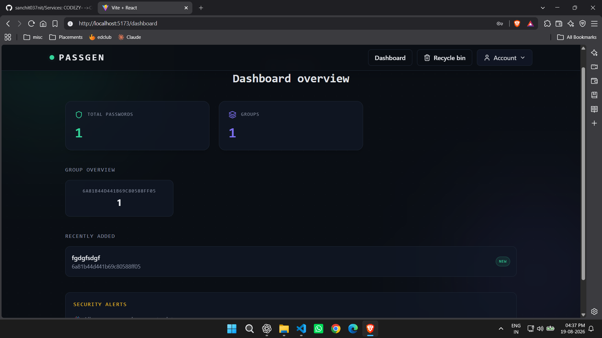
      <br/>
      <b>Dashboard</b>
    </td>
  </tr>

  <tr>
    <td align="center">
      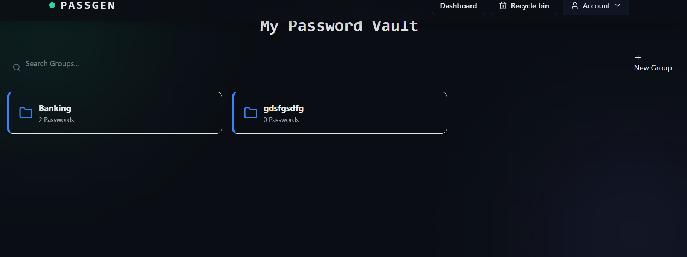
      <br/>
      <b>Groups</b>
    </td>
    <td align="center">
      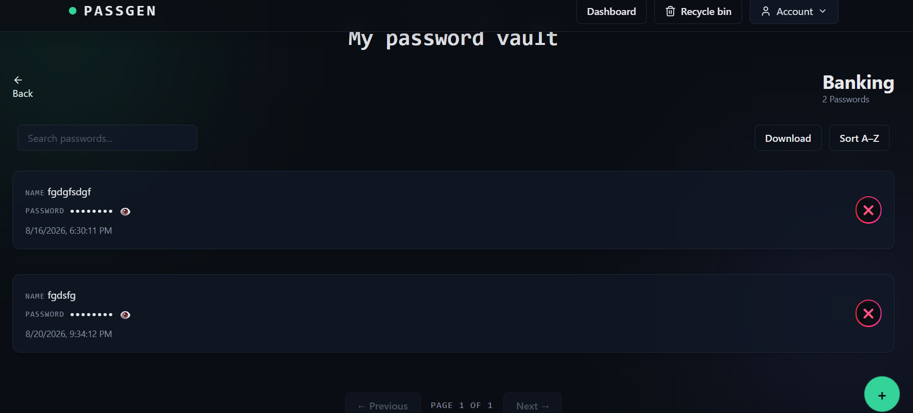
      <br/>
      <b>Password Vault</b>
    </td>
    <td align="center">
      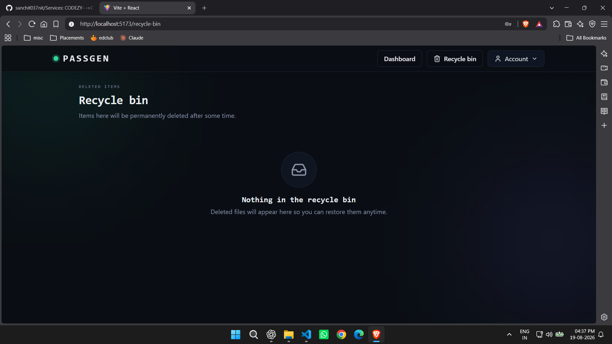
      <br/>
      <b>Recycle Bin</b>
    </td>
  </tr>
</table>

---

<a name="engineering-challenges"></a>

# 🧪 Engineering Challenges

## Challenge 1 — Protecting Recoverable Credentials

A password manager cannot simply hash every password because vault credentials need to be recovered by the authorized user.

### Approach

Separate authentication secrets from vault secrets:

```text
Account Password
      ↓
bcrypt
      ↓
One-way Hash
```

versus:

```text
Vault Credential
      ↓
Encryption
      ↓
Ciphertext
      ↓
Authorized Decryption
```

---

## Challenge 2 — Client-Side Cryptography

The project introduced browser-side cryptographic utilities using the Web Crypto API.

The key derivation flow is:

```text
User Password
      +
User Email
      ↓
SHA-256 Derived Salt
      ↓
PBKDF2
      ↓
AES-256 Key
      ↓
AES-GCM
      ↓
Encrypted Credential
```

This moves part of the cryptographic workflow toward the client.

---

## Challenge 3 — Brute-Force Protection

Repeated incorrect login attempts are tracked.

```text
Failed Login
    ↓
loginAttempts++
    ↓
5 Attempts
    ↓
lockUntil
    ↓
Temporary Account Lock
```

This is complemented by API rate limiting.

---

## Challenge 4 — Biometric Authentication

Adding WebAuthn introduces a fundamentally different authentication model from traditional password login.

The application must coordinate:

```text
Browser
   ↕
Authenticator
   ↕
WebAuthn Challenge
   ↕
Server Verification
```

This requires both client-side and server-side WebAuthn support.

---

## Challenge 5 — Safe Credential Deletion

Immediate deletion makes accidental recovery impossible.

### Approach

Use soft deletion:

```text
deleted = false
       ↓
     Delete
       ↓
deleted = true
       ↓
Recycle Bin
```

Users can then restore or permanently remove the credential.

---

## Challenge 6 — Security Observability

Security events are difficult to investigate without historical information.

### Approach

Introduce audit logging:

```text
Authentication
      │
      ├── Login
      ├── Logout
      └── Lockout

Credential Operations
      │
      ├── Create
      ├── Update
      ├── Delete
      └── Restore

           ↓

       AuditLog
```

---

<a name="contributing"></a>

# 🤝 Contributing

Contributions are welcome.

## 1. Fork the Repository

```bash
git fork https://github.com/sanchit037nit/random-pass.git
```

## 2. Create a Feature Branch

```bash
git checkout -b feature/your-feature
```

## 3. Make Your Changes

Ensure that:

* Secrets are not committed
* Existing authentication behavior is preserved
* Security-sensitive changes are reviewed carefully
* API changes are documented

## 4. Commit

```bash
git commit -m "Add your feature"
```

## 5. Push

```bash
git push origin feature/your-feature
```

## 6. Open a Pull Request

Explain:

* What changed
* Why it was needed
* How it was implemented
* How it was tested

---

<a name="license"></a>

# 📄 License

This project is licensed under the **MIT License**.

---

<a name="author"></a>

# 👨‍💻 Author

## Sanchit Virdi

**Computer Science & Engineering**

**NIT Srinagar**

PassGen was developed as a full-stack engineering project exploring:

> **Web Development + Authentication + Cryptography + Database Design + Security Engineering + AI Integration**

---

<a name="project-summary"></a>

# 🏁 Project Summary

```text
                              PASSGEN
                                 │
        ┌────────────────────────┼────────────────────────┐
        │                        │                        │
        ▼                        ▼                        ▼
 PASSWORD GENERATOR        SECURE VAULT           AUTHENTICATION
        │                        │                        │
        │                        │                ┌───────┴───────┐
        │                        │                │               │
        │                        │               JWT           WebAuthn
        │                        │                │               │
        ▼                        ▼                ▼               ▼
  Strong Passwords         Encryption         Lockout       Biometrics
                                 │
                                 ▼
                         Credential Lifecycle
                                 │
                ┌────────────────┼────────────────┐
                │                │                │
                ▼                ▼                ▼
             Groups          Recycle Bin      Analytics
                │                │                │
                └────────────────┼────────────────┘
                                 ▼
                         Security Monitoring
                                 │
                  ┌──────────────┼──────────────┐
                  ▼              ▼              ▼
             Audit Logs    Security Alerts      AI
                  │              │              │
                  └──────────────┼──────────────┘
                                 ▼
                        Secure User Experience
```

## Core Engineering Concepts

| Area                     | Implementation      |
| ------------------------ | ------------------- |
| Frontend                 | React 19 + Vite     |
| Routing                  | React Router 7      |
| State                    | Zustand             |
| Backend                  | Node.js + Express 5 |
| Database                 | MongoDB + Mongoose  |
| Authentication           | JWT                 |
| Biometric Authentication | WebAuthn            |
| Password Hashing         | bcryptjs            |
| Client Cryptography      | Web Crypto API      |
| Key Derivation           | PBKDF2 + SHA-256    |
| Encryption               | AES-GCM 256-bit     |
| Password Strength        | zxcvbn              |
| API Security             | Rate Limiting       |
| Account Protection       | Login Lockout       |
| Security Monitoring      | Audit Logs          |
| Security Insights        | Security Alerts     |
| AI                       | Groq SDK            |
| Export                   | PDFKit              |
| Data Recovery            | Soft Delete         |
| Database Optimization    | MongoDB Indexes     |
| Architecture             | Modular Monolith    |

---

<a name="final-note"></a>

# ⭐ Final Note

PassGen started as a password generator and evolved into a broader **security-focused credential-management platform**.

The current architecture demonstrates practical engineering across:

```text
Frontend Development
        +
Backend APIs
        +
Authentication
        +
Cryptography
        +
Database Design
        +
Security Engineering
        +
WebAuthn
        +
AI Integration
        +
System Scalability
```

> **Built with ❤️, JavaScript, cryptography, and a strong focus on application security.**
